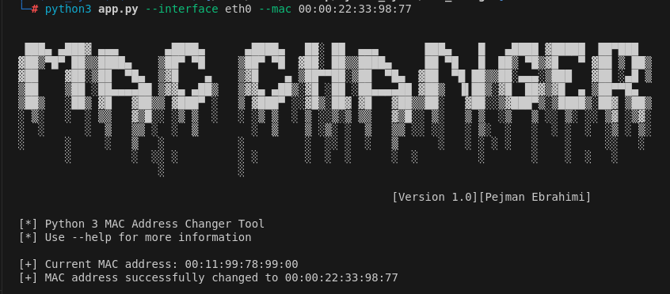
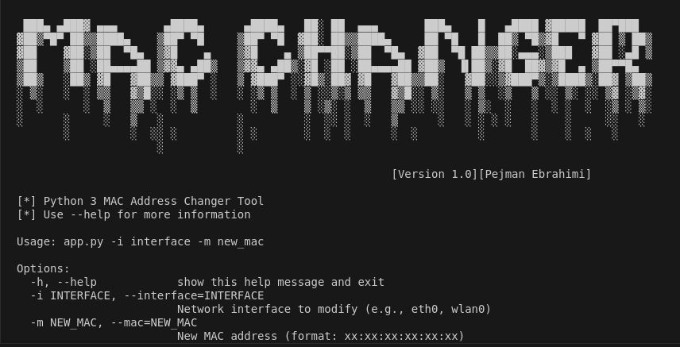

# MAC Address Changer Tool

A robust Python-based command-line utility for changing MAC addresses on network interfaces. This tool provides a secure and reliable way to modify MAC addresses with built-in validation and error handling.



## Table of Contents
- [Overview](#overview)
- [Features](#features)
- [Requirements](#requirements)
- [Installation](#installation)
- [Usage](#usage)
- [Command-line Options](#command-line-options)
- [Examples](#examples)
- [Error Handling](#error-handling)
- [Security Considerations](#security-considerations)
- [Troubleshooting](#troubleshooting)
- [Contributing](#contributing)
- [License](#license)

## Overview
The MAC Address Changer is a command-line tool designed to modify the MAC addresses of network interfaces on Unix-like systems. It includes comprehensive error handling, input validation, and a user-friendly interface.



## Features
- 🔒 Secure MAC address modification
- ✅ Built-in MAC address format validation
- 🔍 Current MAC address detection
- 💻 User-friendly command-line interface
- ⚠️ Comprehensive error handling
- 🛡️ Root privilege checking
- 📝 Detailed operation logging

## Requirements
- Python 3.6 or higher
- Unix-like operating system (Linux, macOS)
- Root/sudo privileges (`sudo -i`)
- `ifconfig` utility installed

## Installation

1. Clone the repository:
```
git clone https://github.com/yourusername/mac-changer.git
cd mac-changer
```
2. Make the script executable:
```
chmod +x app.py
```

## Usage

Basic usage pattern:
```
sudo python3 app.py -i <interface> -m <new_mac>
```

or using long-form arguments:
```
sudo python3 app.py --interface <interface> --mac <new_mac>
```

## Command-line Options

| Command-line Options | Long Form      | Description                                        | Required |
|----------------------|----------------|----------------------------------------------------|----------|
| `-i`                | `--interface`  | Network interface to modify (e.g., eth0, wlan0)    | Yes      |
| `-m`                | `--mac`        | New MAC address (format: xx:xx:xx:xx:xx:xx)        | Yes      |
| `-h`                | `--help`       | Show help message and exit                         | No       |

## Examples

- 1. Change MAC address of eth0:
```
sudo python3 app.py -i eth0 -m 00:11:22:33:44:55
```

- 2. Change MAC address of wlan0:
```
sudo python3 app.py -i wlan0 -m AA:BB:CC:DD:EE:FF
```

## Error Handling

* The tool includes comprehensive error handling for:

- Invalid MAC address format
- Non-existent network interfaces
- Insufficient privileges
- Failed interface operations
- System command failures
- Unexpected interruptions

## Security Considerations

- Always run with appropriate privileges
- Verify MAC address changes after execution
- Be aware of network policies regarding MAC address changes
- Keep logs of MAC address modifications
- Use only on authorized networks and devices

## Troubleshooting

Common issues and solutions:

* 1. Permission Denied 
```
sudo python3 app.py -i eth0 -m 00:11:22:33:44:55
```

* 2. Interface Not Found

- Verify interface name using ifconfig
- Ensure interface is not disabled


* 3. Invalid MAC Format

- Use correct format: xx:xx:xx:xx:xx:xx
- Use hexadecimal values only (0-9, A-F)

## Contributing

Contributions are welcome! Please feel free to submit a Pull Request. For major changes:

- Fork the repository
- Create your feature branch (git checkout -b feature/AmazingFeature)
- Commit your changes (git commit -m 'Add some AmazingFeature')
- Push to the branch (git push origin feature/AmazingFeature)
- Open a Pull Request

## License

This project is licensed under the MIT License - see the LICENSE file for details.

* Created by `Pejman Ebrahimi` - Feel free to contact me at [pejman.ebrahimi77@gmail.com] & [pejman.ebrahimi@uni.li]
